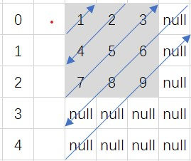
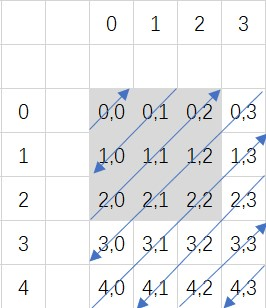

# 对角线遍历

## 题目描述
给定一个含有 M x N 个元素的矩阵（M 行，N 列），请以对角线遍历的顺序返回这个矩阵中的所有元素，对角线遍历如下图所示。

```c
示例:
输入:
[
 [ 1, 2, 3 ],
 [ 4, 5, 6 ],
 [ 7, 8, 9 ]
]
输出:  [1,2,4,7,5,3,6,8,9]
```


## 解析
- 首先查看方向信息，可以得出规律，当行号为偶数是，遍历方向网上，行号为奇数时，遍历方向往下,外围部分使用null进行补全


- 这样，可以每一行来遍历，再由行号来确定方向即可

- 再遍历的过程中，不管是上还是下，时钟有一个方向的坐标是和遍历顺序是一样的，另一个为其互补数


- 可以看到，奇数时，Y随遍历值变化，偶数时，X随遍历值变化。

## 代码
### C++
```cpp
class Solution {
public:
    vector<int> findDiagonalOrder(vector<vector<int>>& matrix) {
        /*
        0 1 2 3 4 5 ··· m
        1
        2
        3
        ·
        ·
        ·
        n
        */
        vector<int> ret;
        int m = matrix.size();  // 行数
        if (m == 0) return ret;
        int n = matrix[0].size();   // 列数
        int x, y;
        for (int line = 0; line < m + n - 1; line++)    // 遍历行
        {
            // 判断数字方向
            if (line % 2)  // 向下 
            {
                for (int i = 0; i <= line; ++i) 
                {
                    // 遍历对角线元素
                    x = i;  // X随遍历变化
                    y = line - i;   // Y为互补值
                    if (x < m && y < n) // 判断是否时在数组范围内
                        ret.push_back(matrix[x][y]);    // 添加到新的数组中
                }
            }
            else    // 向上
            {
                for (int i = 0; i <= line; ++i)
                {
                    y = i;
                    x = line - i;
                    if (x < m && y < n)
                        ret.push_back(matrix[x][y]);
                }
            }
        }
        return ret;
    }
};
```