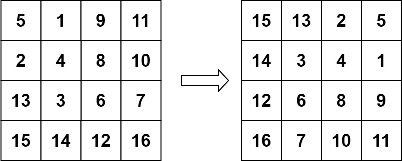

# 旋转图像

## 题目描述
给定一个 n × n 的二维矩阵 matrix 表示一个图像。请你将图像顺时针旋转 90 度。

你必须在 原地 旋转图像，这意味着你需要直接修改输入的二维矩阵。请不要 使用另一个矩阵来旋转图像。


```c
示例 1：
输入：matrix = [[1,2,3],[4,5,6],[7,8,9]]
输出：[[7,4,1],[8,5,2],[9,6,3]]
```


```c
示例 2：
输入：matrix = [[5,1,9,11],[2,4,8,10],[13,3,6,7],[15,14,12,16]]
输出：[[15,13,2,5],[14,3,4,1],[12,6,8,9],[16,7,10,11]]
```

```c
示例 3：
输入：matrix = [[1]]
输出：[[1]]
```
```c
示例 4：
输入：matrix = [[1,2],[3,4]]
输出：[[3,1],[4,2]]
```

```c
提示：
matrix.length == n
matrix[i].length == n
1 <= n <= 20
-1000 <= matrix[i][j] <= 1000
```

## 解析
#### 方法1
- 由于需要进行原地操作
- 首先对矩阵进行上下反转
- 再对矩阵按照对角线反转


## 代码实现
#### 方法1：
#### CPP
```C++
class Solution {
public:
    void rotate(vector<vector<int>>& matrix) {
        int rows = matrix.size();
        int cols = rows;
        if (rows <= 1)
            return ;
        // 先进行上下的反转
        for (int i = 0; i < cols ; i++)
        {
            for (int j = 0; j < (rows / 2); j++)
            {
                int temp = matrix[j][i];
                matrix[j][i] = matrix[rows - j - 1][i];
                matrix[rows - j - 1][i] = temp;
            }
        }
        // 再进行对角线反转
        for (int i = 0; i  < rows; i++)
        {
            for (int j = 0; j < i; j++)
            {
                int temp = matrix[i][j];
                matrix[i][j] = matrix[j][i];
                matrix[j][i] = temp;
            }
        }
    }
};
```