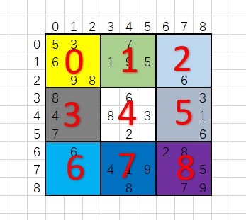

# 有效的数独

## 题目描述
判断一个 9x9 的数独是否有效。只需要根据以下规则，验证已经填入的数字是否有效即可。

数字 1-9 在每一行只能出现一次。
数字 1-9 在每一列只能出现一次。
数字 1-9 在每一个以粗实线分隔的 3x3 宫内只能出现一次。


上图是一个部分填充的有效的数独。

数独部分空格内已填入了数字，空白格用 '.' 表示。

#### 示例 1:

```c
输入:
[
  ["5","3",".",".","7",".",".",".","."],
  ["6",".",".","1","9","5",".",".","."],
  [".","9","8",".",".",".",".","6","."],
  ["8",".",".",".","6",".",".",".","3"],
  ["4",".",".","8",".","3",".",".","1"],
  ["7",".",".",".","2",".",".",".","6"],
  [".","6",".",".",".",".","2","8","."],
  [".",".",".","4","1","9",".",".","5"],
  [".",".",".",".","8",".",".","7","9"]
]
输出: true
```

#### 示例 2:
```c
输入:
[
  ["8","3",".",".","7",".",".",".","."],
  ["6",".",".","1","9","5",".",".","."],
  [".","9","8",".",".",".",".","6","."],
  ["8",".",".",".","6",".",".",".","3"],
  ["4",".",".","8",".","3",".",".","1"],
  ["7",".",".",".","2",".",".",".","6"],
  [".","6",".",".",".",".","2","8","."],
  [".",".",".","4","1","9",".",".","5"],
  [".",".",".",".","8",".",".","7","9"]
]
输出: false
解释: 除了第一行的第一个数字从 5 改为 8 以外，空格内其他数字均与 示例1 相同。
     但由于位于左上角的 3x3 宫内有两个 8 存在, 因此这个数独是无效的。
```

```c
说明:
一个有效的数独（部分已被填充）不一定是可解的。
只需要根据以上规则，验证已经填入的数字是否有效即可。
给定数独序列只包含数字 1-9 和字符 '.' 。
给定数独永远是 9x9 形式的。
```


## 解析
#### 方法1：
- 由于对于指定的区域内数字只能出现一次，因此可以使用数组来进行存储，判断对应位置是否已经使用。
- 使用三个 9 * 9 的二维数组来进行存储，分别做行列和 3 * 3 方块的判断。
- 在遍历时，行和列可以一起进行判断。
- 由于 3 * 3 区域内需要进行判断，这里需要将3 * 3的区域内转化为成数组。
- 首先需要对区域进行划分

- 需要将区域内数据转换到一维数组中，这里使用公式 (row / 3) * 3 + col / 3,这样可以进行区域的划分。
- 之后将区域内的值作为索引，填入数组即可


## 代码实现
### 方法1：
#### CPP
```C++
class Solution {
public:
    bool isValidSudoku(vector<vector<char>>& board) {
        vector<vector<int>> cols_value(9, vector<int>(9, 0));
        vector<vector<int>> rows_value(9, vector<int>(9, 0));
        vector<vector<int>> block_value(9, vector<int>(9, 0));
        for (int i = 0; i < 9; i++)
        {
            for (int j = 0; j < 9; j++)
            {
                if (board[i][j] != '.')
                {
                    int value = board[i][j] - '0' - 1;
                    int block_index = (i / 3) * 3 + j / 3;
                    if (cols_value[i][value])
                        return false;
                    else
                        cols_value[i][value] = 1;

                    if (rows_value[j][value])
                        return false;
                    else
                        rows_value[j][value] = 1;

                    if (block_value[block_index][value])
                        return false;
                    else
                        block_value[block_index][value] = 1;
                }
            }
        }
        return true;
    }
};
```