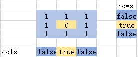

# 零矩阵

## 题目描述
编写一种算法，若M × N矩阵中某个元素为0，则将其所在的行与列清零。

```c
示例 1：
输入：
[
  [1,1,1],
  [1,0,1],
  [1,1,1]
]
输出：
[
  [1,0,1],
  [0,0,0],
  [1,0,1]
]

示例 2：
输入：
[
  [0,1,2,0],
  [3,4,5,2],
  [1,3,1,5]
]
输出：
[
  [0,0,0,0],
  [0,4,5,0],
  [0,3,1,0]
]
```

## 分析
- 将二维数组中的存在0的行列清零

## 解析
- 可以使用投影的思想来解决
- 对于二维数组，可以投影成两个一维数组，从X方向和Y方向投影

- 这样了两个记录行号的数组
- 依次遍历二维数组，记录出现0的位置，将两个数组对应的位置置为true
- 再次遍历二维数组，查询连个数组，再将出现true的位置映射回二维数组


## 代码实现

### C++实现
```cpp
class Solution {
public:
    void setZeroes(vector<vector<int>>& matrix) {
        if (matrix.size() == 0) return;

        // 使用两个额外的数组来记录，数组大小分别为二维数组的行和列数目
        vector<bool> rows(matrix.size(), false);
        vector<bool> cols(matrix[0].size(), false);

        // 遍历数组，记录出现0的位置
        for (int i = 0; i < matrix.size(); i++)
        {
            for (int j = 0 ; j < matrix[0].size(); j++)
            {
                if (!matrix[i][j])
                {
                    rows[i] = true;
                    cols[j] = true;
                }
            }
        }

        //再次遍历数组，判断数组，对之前记录位置的行和列进行清零
        for (int i = 0; i < matrix.size(); i++)
        {
            for (int j = 0; j < matrix[0].size(); j++)
            {
                if (rows[i] || cols[j])
                {
                    matrix[i][j] = 0;
                }
            }
        }
    }
};
```