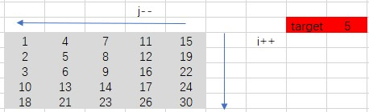
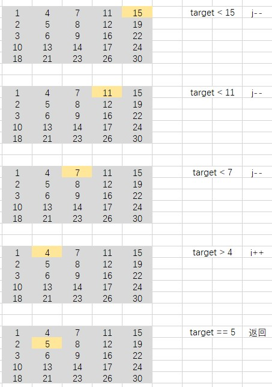

# 剑指 Offer 04. 二维数组中的查找

## 题目描述
在一个 n * m 的二维数组中，每一行都按照从左到右递增的顺序排序，每一列都按照从上到下递增的顺序排序。请完成一个高效的函数，输入这样的一个二维数组和一个整数，判断数组中是否含有该整数。

```c
示例:
现有矩阵 matrix 如下：
[
  [1,   4,  7, 11, 15],
  [2,   5,  8, 12, 19],
  [3,   6,  9, 16, 22],
  [10, 13, 14, 17, 24],
  [18, 21, 23, 26, 30]
]
给定 target = 5，返回 true。
给定 target = 20，返回 false。


限制：
0 <= n <= 1000
0 <= m <= 1000
```

## 解析
#### 方法1： 暴力破解
- 直接遍历整个数组，然后挨个比较数值与 target 是否相同，相同则返回

#### 方法2：
- 由于数组中的横向和竖向都是递增的，因此可以按照规律查找
- 取数组的右上角元素，作为起始元素
- 当 target 大于该元素时，说明 target 在当前元素的下面一行
- 当 target 小于该元素时，说明 target 在当前元素的左边一行
- 直到遍历完成数组或找到元素则返回
- 
- 


## 代码实现
### CPP
###### 按规律查找
```C++
int rows = matrix.size();
        if (rows == 0)
            return false;
        int cols = matrix[0].size();
        int i = 0;
        int j = cols - 1;
        while(i < rows && j >= 0)
        {
            if (matrix[i][j] > target)
            {
                j--;
            }
            else if (matrix[i][j] < target) 
            {
                i++;
            }
            else
            {
                return true;
            }
        }
        return false;
```
###### 暴力破解
```C++
class Solution {
public:
    bool findNumberIn2DArray(vector<vector<int>>& matrix, int target) {
        int rows = matrix.size();
        if (rows == 0)
            return false;
        int cols = matrix[0].size();
        for (int i = 0; i < rows; i++)
        {
            for (int j = 0; j < cols; j++)
            {
                if (matrix[i][j] == target)
                    return true;
            }
        }
        return false;
    }
};
```
### Java
###### 按规律查找
```Java
class Solution {
    public boolean findNumberIn2DArray(int[][] matrix, int target) {
        if(matrix==null||matrix.length==0) {
			return false;
		}
		int m=matrix.length,n=matrix[0].length;
		int row=0,col=n-1;
		while(row<m&&col>=0) {
			if(matrix[row][col]>target) {
				col--;
			}else if(matrix[row][col]<target) {
				row++;
			}else {
				return true;
			}
		}
		return false;
    }
}
```