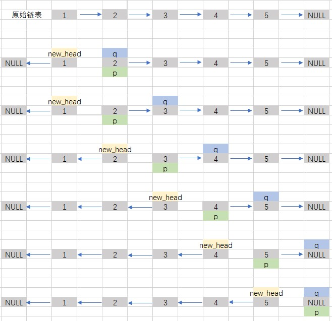

# 剑指 Offer 24. 反转链表

## 题目描述
定义一个函数，输入一个链表的头节点，反转该链表并输出反转后链表的头节点。
 
```c
示例:
输入: 1->2->3->4->5->NULL
输出: 5->4->3->2->1->NULL

限制：
0 <= 节点个数 <= 5000
```

## 解析
#### 方法1：
- 双指针


## 代码实现
#### CPP
```C++
/**
 * Definition for singly-linked list.
 * struct ListNode {
 *     int val;
 *     ListNode *next;
 *     ListNode(int x) : val(x), next(NULL) {}
 * };
 */
class Solution {
public:
    ListNode* reverseList(ListNode* head) {
        if (head == NULL || head->next == NULL)
            return head;
        ListNode* p = head->next;
        ListNode* q = head->next;
        ListNode* new_head = head;
        new_head->next = NULL;
        while(q != NULL)
        {
            q = q->next;
            p->next = new_head;
            new_head = p;
            p = q;
        }
        return new_head;
    }
};
```