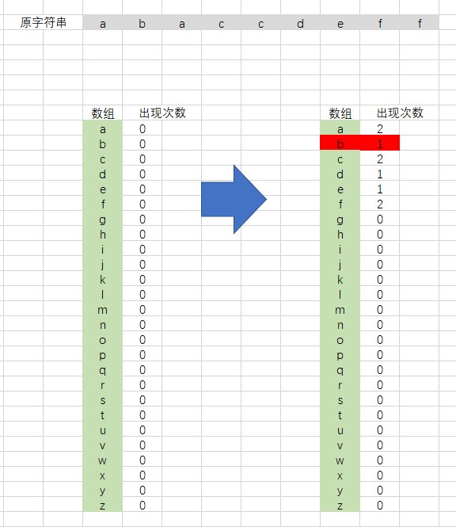

# 剑指 Offer 50. 第一个只出现一次的字符

## 题目描述
在字符串 s 中找出第一个只出现一次的字符。如果没有，返回一个单空格。 s 只包含小写字母。

```c
示例:
s = "abaccdeff"
返回 "b"

s = "" 
返回 " "

限制：
0 <= s 的长度 <= 50000
```

## 解析
#### 方法1：
- 首先定义一个数组，用于存储 a - z 26个字母
- 遍历字符串，由于都是小写，因此可以将字符值减去 'a' ，便可以得到对应的字母序号，这时再填充到数组中
- 第二次遍历字符串，查找数组中存储数为 1 的位置，对应的字符就是第一次出现的字符


## 代码实现
#### CPP
```C++
class Solution {
public:
    char firstUniqChar(string s) {
        int array[26] = {0};
        for (auto a : s)    // 第一次遍历字符串，向数组中进行填充
        {
            array[a - 'a']++;
        }
        for (auto a : s)    // 第二次遍历字符串，进行查找
        {
            if (array[a - 'a'] == 1)    return a;
        }
        return ' ';
    }
};
```
#### Python3
```python
class Solution:
    def firstUniqChar(self, s: str) -> str:
        dic = {}
        for i in s:
            dic[i] = not i in dic
        for i in s:
            if dic[i]: return i
        return ' '
```