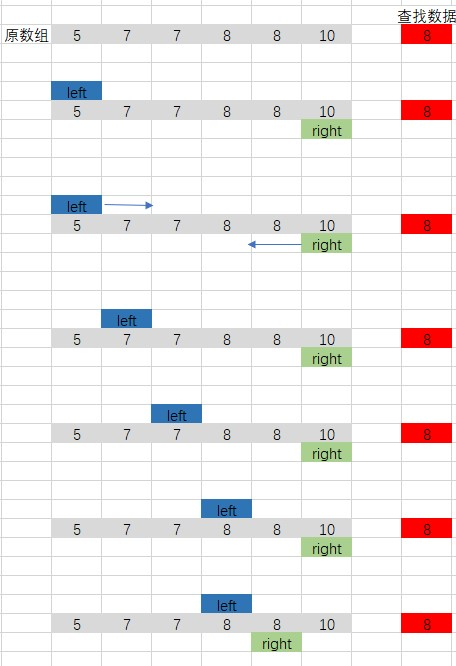

# 剑指 Offer 53 - I. 在排序数组中查找数字 I

## 题目描述
统计一个数字在排序数组中出现的次数。

```c
示例 1:
输入: nums = [5,7,7,8,8,10], target = 8
输出: 2

示例 2:
输入: nums = [5,7,7,8,8,10], target = 6
输出: 0
 
限制：
0 <= 数组长度 <= 50000
```


## 解析
#### 方法1：
- 首先数组是有序的，因此所有的相同的数据会在一起
- 定义两个指针，分别指向数组的开始和结尾，并且同时向中间移动
- 如果两个指针相遇，则不存在数据
- 如果两个指针分别找到对应的数据，那么直接计算两个指针之间的差值就是相同数据的个数


## 代码实 现
#### CPP
```C++
class Solution {
public:
    int search(vector<int>& nums, int target) {
        int count = nums.size();
        if (count == 0)
            return 0;
        int left = 0;
        int right = count - 1;
        while(left <= right)
        {
            while(left <= right && (nums[left] != target))
                left++;
            while(left <= right && (nums[right] != target))
                right--;
            if (left <= right)
                return (right - left + 1);
        }
        return 0;
    }
};
```