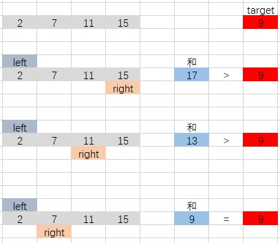

# 剑指 Offer 57. 和为s的两个数字

## 题目描述
输入一个递增排序的数组和一个数字s，在数组中查找两个数，使得它们的和正好是s。如果有多对数字的和等于s，则输出任意一对即可。

 
```c
示例 1：
输入：nums = [2,7,11,15], target = 9
输出：[2,7] 或者 [7,2]

示例 2：
输入：nums = [10,26,30,31,47,60], target = 40
输出：[10,30] 或者 [30,10]

限制：
1 <= nums.length <= 10^5
1 <= nums[i] <= 10^6
```

## 解析
#### 方法1：
- 创建一个足够的大数组，遍历需要查找的数组，将数组元素作为下标
- 标记新的数组中，当前数是否存在
- 遍历源数组，使用 target 减去当前数字之后的数作为下标去查询该数字是否存在
- 如果存在则返回，不存在则查询下一个

#### 方法2：双指针
- 首尾两个指针，分别向中间移动
- 判断两个指针所在位置的大小关系
- 如果当前位置和 大于 target，则尾指针移动
- 如果当前位置和 小于 target，则首指针移动
- 如果相等则返回



## 代码实现
#### CPP
#####  方法1：
```C++
class Solution {
public:
    vector<int> twoSum(vector<int>& nums, int target) {
        vector<int> ret;
        int array[10 * 10 * 10 * 10 * 10 * 10 * 10] = {0};
        int count = nums.size();
        if (count < 1)
            return ret;
        for (auto num : nums)
        {
            array[num] = 1;
        }
        for (int num : nums)
        {
            if (array[target - num])
            {
                ret.push_back(num);
                ret.push_back(target - num);
                break;
            }
        }
        return ret;
    }
};
```

##### 方法2：
```C++
class Solution {
public:
    vector<int> twoSum(vector<int>& nums, int target) {
        vector<int> ret;
        int count = nums.size();
        if (count < 1)
            return ret;
        int left = 0;
        int right = count - 1;
        while(right > left)
        {
            if ((nums[left] + nums[right]) > target)
            {
                right--;
            }
            else if ((nums[left] + nums[right]) < target)
            {
                left++;
            }
            else
            {
                ret.push_back(nums[left]);
                ret.push_back(nums[right]);
                break;
            }
        }
        return ret;
    }
};
```
#### Python3
```python
class Solution:
    def twoSum(self, nums: List[int], target: int) -> List[int]:
        left, right = 0, len(nums) - 1
        while left < right:
            s = nums[left] + nums[right]
            if s > target: right -= 1
            elif s < target: left += 1
            else: return [nums[left], nums[right]]
        return []
```