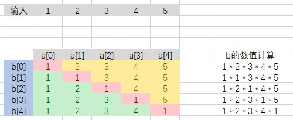

# 剑指 Offer 66. 构建乘积数组

## 题目描述

给定一个数组 A[0,1,…,n-1]，请构建一个数组 B[0,1,…,n-1]，其中 B[i] 的值是数组 A 中除了下标 i 以外的元素的积, 即 B[i]=A[0]×A[1]×…×A[i-1]×A[i+1]×…×A[n-1]。不能使用除法。

```c
示例:
输入: [1,2,3,4,5]
输出: [120,60,40,30,24]
 
提示：
所有元素乘积之和不会溢出 32 位整数
a.length <= 100000
```

## 解析
#### 方法1：
- 新数组中的元素计算可以看成 b[i] = a[0] * a[1] * ··· * a[i - 1] * a[i] * a[i + 1] * ··· * a[n], 此时 a[i] 的值可以表示为 1，也就相当于没有乘
- 这时将这个过程列成表格 
- 这样的话可以看成一个矩阵，实际上就是除去对角线元素的上下部分的乘积
- 这样可以计算上下两个对角的数值，之后再进行相乘即可


## 代码实现
#### CPP
```C++
class Solution {
public:
    vector<int> constructArr(vector<int>& a) {
        int count = a.size();
        vector<int> up_array(count, 1);     // 上半部分数组乘积
        vector<int> down_array(count, 1);   // 下半部分数组乘积
        vector<int> ret;
        // 计算上半部分
        for (int i = count - 2; i >= 0; i--)
        {
            up_array[i] = up_array[i + 1] * a[i + 1];
        }
        //计算下半部分
        for (int i = 1; i < count; i++)
        {
            down_array[i] = down_array[i - 1] * a[ i - 1];
        }
        //计算最终结果
        for (int i = 0; i < count; i++)
        {
            ret.push_back(up_array[i] * down_array[i]);
        }
        return ret;
    }
};
```