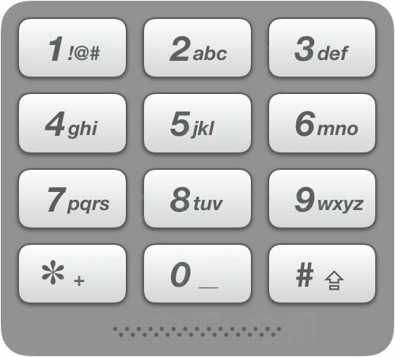

# 17. 电话号码的字母组合

## 题目描述
给定一个仅包含数字 2-9 的字符串，返回所有它能表示的字母组合。答案可以按 任意顺序 返回。

给出数字到字母的映射如下（与电话按键相同）。注意 1 不对应任何字母。


 


### 示例 1：
```
输入：digits = "23"
输出：["ad","ae","af","bd","be","bf","cd","ce","cf"]
```
### 示例 2：
```
输入：digits = ""
输出：[]
```
### 示例 3：
```
输入：digits = "2"
输出：["a","b","c"]
```

### 提示：

 - 0 <= digits.length <= 4
 - digits[i] 是范围 ['2', '9'] 的一个数字。


## 代码实现
```Java
class Solution {
    public List<String> letterCombinations(String digits) {
        List<String> res = new ArrayList<String>();
		if(digits.equals("")) {
			return res;
		}
		List<String> param = new ArrayList<String>();
		Map<String,String> map = new HashMap<String, String>();
		map.put("2", "abc");
		map.put("3", "def");
		map.put("4","ghi");
		map.put("5","jkl");
		map.put("6", "mno");
		map.put("7","pqrs");
		map.put("8","tuv");
		map.put("9", "wxyz");
		for(char c:digits.toCharArray()) {
			param.add(map.get(c+""));
		}
		combinations(res, param,new StringBuffer(""), 0);
		return res;
    }
    public void combinations(List<String> res,List<String> param, StringBuffer s,int idx) {
		if(s.length()==param.size()) {
			res.add(new String(s));
			return;
		}
		for(int i=0;i<param.get(idx).length();i++) {
			s.append(param.get(idx).charAt(i));
			combinations(res,param,s,idx+1);
			s.delete(s.length()-1, s.length());
		}
	}
};
```
#### CPP
```C++
class Solution {
public:
    vector<string> letterCombinations(string digits) {
        vector<string> ret;
        if (digits.length() == 0)
            return ret;
        unordered_map<char, string> numberMap{
            {'2', "abc"},
            {'3', "def"},
            {'4', "ghi"},
            {'5', "jkl"},
            {'6', "mno"},
            {'7', "pqrs"},
            {'8', "tuv"},
            {'9', "wxyz"}
        };
        string str;
        backtrack(ret, numberMap, digits, 0, str);
        return ret;
    }
    void backtrack(vector<string>& ret, const unordered_map<char, string> numberMap, const string digits, int index, string& str)
    {
		// 提供的数字字符串的长度表示树的深度
        if (index == digits.length())
        {
            ret.push_back(str);	// 到了叶子节点，进行添加
        }
        else
        {
            char num = digits[index];	// 取当前的数字
            string num_str = numberMap.at(num);	//	取数字表示的字母
            for (char c : num_str)
            {
                str.push_back(c);	//	进入该节点
                backtrack(ret, numberMap, digits, index + 1, str);	//
                str.pop_back();	// 退回到上一个节点
            }
        }
    }
};
```