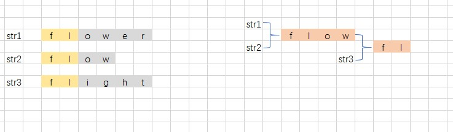

# 最长公共前缀

## 描述
```c
编写一个函数来查找字符串数组中的最长公共前缀。
如果不存在公共前缀，返回空字符串 ""。

 
示例 1：
输入：strs = ["flower","flow","flight"]
输出："fl"


示例 2：
输入：strs = ["dog","racecar","car"]
输出：""
解释：输入不存在公共前缀。


提示：
0 <= strs.length <= 200
0 <= strs[i].length <= 200
strs[i] 仅由小写英文字母组成
```

## 解析
- 如果存在公共前缀，则可以使用任意一个字符串与其他字符串进行比较，每次比较之后回生成一个新的字符串
- 新的字符串就是这两个字符串的公共部分
- 在使用新的字符串去和下一个字符串比较，重复第一步，这样循环这个字符串数组即可得到公共前缀



## 代码实现

### cpp
```cpp
class Solution {
public:
    string longestCommonPrefix(vector<string>& strs) {
        string ret = strs.size() == 0 ? "" : strs[0];
        for (string str : strs )    // 遍历整个字符串数组
        {
            ret = strcmpss(ret, str);
        }
        return ret;
    }
    string strcmpss(string str1, string str2)   //两个字符串的比较函数，返回公共部分
    {
        string ret = "";
        for (int i = 0; i < str1.size(); i++)
        {
            if (str1[i] == str2[i])
                ret += str1[i];
            else
                break;
        }
        return ret;
    }
};
```
```cpp
class Solution {
public:
    string longestCommonPrefix(vector<string>& strs) {
        string ret = strs.empty() ? "" : strs[0];
        for (string s : strs)
        {
            while(s.find(ret) != 0) //使用cpp的库函数
            {
                ret = ret.substr(0, ret.length() - 1);
            }
        }
        return ret;
    }
};
```