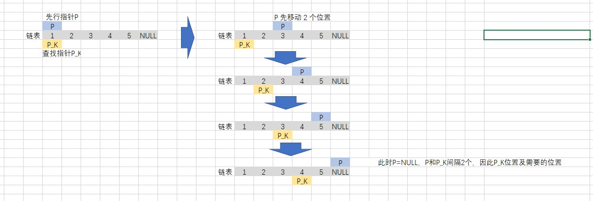

# 返回倒数第 k 个节点

## 题目描述
实现一种算法，找出单向链表中倒数第K个节点。返回该节点的值。

```c
示例：
输入： 1->2->3->4->5 和 k = 2
输出： 4

说明：
给定的 k 保证是有效的。
```

## 解析
### 双指针实现
- 定义两个指针，初始化时均指向链表的头节点
- 首先将先行指针向后移动需要查找的位置的次数
- 再将两个指针一起移动
- 当先行指针到达链表结尾时，查找指针的位置便是需要的位置


## 实现
### CPP
```C++
/**
 * Definition for singly-linked list.
 * struct ListNode {
 *     int val;
 *     ListNode *next;
 *     ListNode(int x) : val(x), next(NULL) {}
 * };
 */
class Solution {
public:
    int kthToLast(ListNode* head, int k) {
        ListNode* p = head;         // 先行指针
        ListNode* p_k = head;       // 查找的指针
        while(k--)                  // 先将先行指针移动K 个位置
            p = p->next;
        while(p != NULL)            // 两个指针一起移动，直到先行指针到达尾部
        {
            p = p->next;
            p_k = p_k->next;
        }
        return p_k->val;
    }
};
```