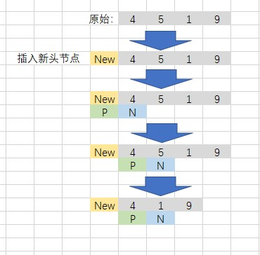

# 删除链表的节点
## 题目描述

给定单向链表的头指针和一个要删除的节点的值，定义一个函数删除该节点。
返回删除后的链表的头节点。

注意：此题对比原题有改动
```c
示例 1:
输入: head = [4,5,1,9], val = 5
输出: [4,1,9]
解释: 给定你链表中值为 5 的第二个节点，那么在调用了你的函数之后，该链表应变为 4 -> 1 -> 9.

示例 2:
输入: head = [4,5,1,9], val = 1
输出: [4,5,9]
解释: 给定你链表中值为 1 的第三个节点，那么在调用了你的函数之后，该链表应变为 4 -> 5 -> 9.
 
说明：
题目保证链表中节点的值互不相同
若使用 C 或 C++ 语言，你不需要 free 或 delete 被删除的节点
```

## 解析
- 该题可以使用双指针的方法来进行计算，由于需要考虑头节点就是需要删除的节点，因此可以在头节点之前插入一个空的节点，充当新的头节点，这样就不需要考虑特殊情况了。
- 定义两个指针，一个指向新的头节点，另一个指向下一个节点
- 判断第二个指针是否是需要删除的节点，如果是则删除，否则两个指针均往下移动一个。
- 直到第二个指针遍历完链表
- 返回新头节点的next指针指向的节点即可。



## 实现
### CPP
```C++
/**
 * Definition for singly-linked list.
 * struct ListNode {
 *     int val;
 *     ListNode *next;
 *     ListNode(int x) : val(x), next(NULL) {}
 * };
 */
class Solution {
public:
    ListNode* deleteNode(ListNode* head, int val) {
        ListNode* First_Null_Node = new ListNode(0);    //创建一个新的头节点
        First_Null_Node->next = head;                   
        ListNode* p;
        ListNode* n; 
        p = First_Null_Node;
        n = First_Null_Node->next;
        while(n != NULL)
        {
            if (n->val == val)
            {
                p->next = n->next;
                break;
            }
            else
            {
                p = p->next;
                n = n->next;
            }
        }
        return First_Null_Node->next;
    }
};
```