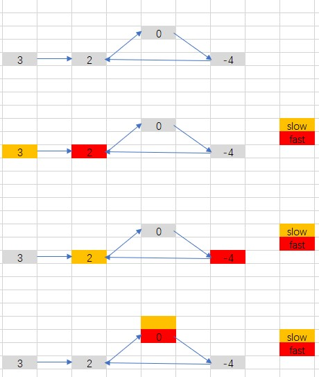

# 环形链表

## 题目描述
给定一个链表，判断链表中是否有环。

如果链表中有某个节点，可以通过连续跟踪 next 指针再次到达，则链表中存在环。 为了表示给定链表中的环，我们使用整数 pos 来表示链表尾连接到链表中的位置（索引从 0 开始）。 如果 pos 是 -1，则在该链表中没有环。注意：pos 不作为参数进行传递，仅仅是为了标识链表的实际情况。

如果链表中存在环，则返回 true 。 否则，返回 false 。

进阶：
你能用 O(1)（即，常量）内存解决此问题吗？

##### 示例1

```c
输入：head = [3,2,0,-4], pos = 1
输出：true
解释：链表中有一个环，其尾部连接到第二个节点。
```

##### 示例2

```c
输入：head = [1,2], pos = 0
输出：true
解释：链表中有一个环，其尾部连接到第一个节点。
```

##### 示例3

```c
示例 3：
输入：head = [1], pos = -1
输出：false
解释：链表中没有环。
```
```c
提示：
链表中节点的数目范围是 [0, 104]
-105 <= Node.val <= 105
pos 为 -1 或者链表中的一个 有效索引 。
```

## 解析
#### 方法1：快慢指针
- 定义两个指针，快指针和慢指针
- 快指针每次移动两个位置
- 满指针每次移动一个位置
- 如果链表成环，那么快慢指针一定相遇
- 如果快指针达到NULL，那么说明链表不成环



## 代码实现
#### 方法1：快慢指针
#### CPP
```C++
/**
 * Definition for singly-linked list.
 * struct ListNode {
 *     int val;
 *     ListNode *next;
 *     ListNode(int x) : val(x), next(NULL) {}
 * };
 */
class Solution {
public:
    bool hasCycle(ListNode *head) {
        if (head == NULL || head->next == NULL)
            return false;
        ListNode *slow = head;
        ListNode *fast = head->next;
        while(slow != fast) // 不相等则一直循环
        {
            if (fast == NULL || fast->next == NULL) // 如果快指针指向了 NULL，那么一定不成环
                return false;
            slow = slow->next;  // 慢指针一定一个元素
            fast = fast->next->next; // 快指针移动两个元素
        }
        return true;
    }
};
```