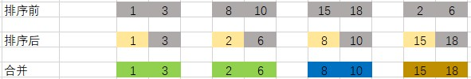

# 合并区间

## 题目描述
给出一个区间的集合，请合并所有重叠的区间。

```c
示例 1:
输入: intervals = [[1,3],[2,6],[8,10],[15,18]]
输出: [[1,6],[8,10],[15,18]]
解释: 区间 [1,3] 和 [2,6] 重叠, 将它们合并为 [1,6].

示例 2:
输入: intervals = [[1,4],[4,5]]
输出: [[1,5]]
解释: 区间 [1,4] 和 [4,5] 可被视为重叠区间。
```

## 分析
- 存在若干个区间，每一个区间内的数字都是有序的
- 每一个区间相互间没有顺序


## 解析
- 首先需要对每一个区间进行排序，因为区间内是有序的，因此按照每一个区间的左点值来进行排序
- 排序完成后，新建一个新的数组
- 将第一个区间添加到新的数组中
- 之后遍历剩下的数组，判断新数组中最后一个区间的右值(new_end[1])和等待插入区间的左值(sort_old[0])进行比较
- 如果 new_end[1] < sort_old[0], 则将其插入到新数组中
- 否则则将 new_end[1] 更新为等待插入的数组和new_end[1]中的最大值



## 代码实现
#### CPP
```cpp
class Solution {
public:
    vector<vector<int>> merge(vector<vector<int>>& intervals) {
        if (intervals.size() == 0)  return {};
        sort(intervals.begin(), intervals.end());   // 排序
        vector<vector<int>> ret;
        int left_value, right_value;    // 等待插入数组的左值和右值
        for (int i = 0; i < intervals.size(); i++)
        {
            left_value = intervals[i][0];
            right_value = intervals[i][1];
            if (!ret.size() || ret.back()[1] < left_value)  // 如果为空则插入第一个区间，否则则判断大小
                ret.push_back({left_value, right_value});   //插入符合条件的区间
            else
                ret.back()[1] = max(ret.back()[1], right_value);    //更新区间
        }
        return ret;
    }
};
```