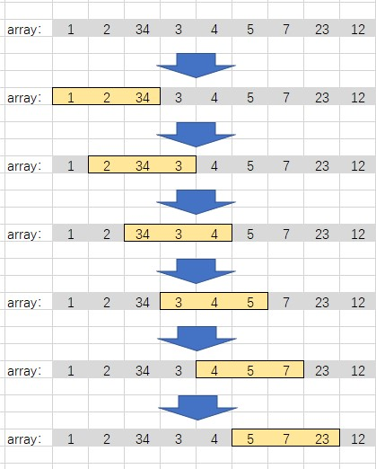

# 存在连续三个奇数的数组

## 题目描述
给你一个整数数组 arr，请你判断数组中是否存在连续三个元素都是奇数的情况：如果存在，请返回 true ；否则，返回 false 。

```c
示例 1：
输入：arr = [2,6,4,1]
输出：false
解释：不存在连续三个元素都是奇数的情况。

示例 2：
输入：arr = [1,2,34,3,4,5,7,23,12]
输出：true
解释：存在连续三个元素都是奇数的情况，即 [5,7,23] 。
 
提示：
1 <= arr.length <= 1000
1 <= arr[i] <= 1000
```

## 解析
- 该题可以使用滑动窗来进行计算
- 定义一个大小为 3 的窗口，之后便判断窗口中是否是全奇数即可，如果不是则窗口往后滑动，知道数组结束。


## 代码实现
```CPP
class Solution {
public:
    bool threeConsecutiveOdds(vector<int>& arr) {
        int count = arr.size();
        if (count < 3)
            return false;
        for (int i = 0 ; i <= count - 3; i++)
        {
            if (is_odd(arr[i]) && is_odd(arr[i + 1]) && is_odd(arr[i + 2]))
                return true;
        }
        return false;
    }

    bool is_odd(int value)
    {
        return !(value % 2 == 0);
    }
};
```