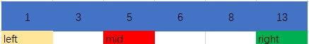
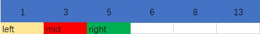

# 搜索插入位置

## 题目描述
给定一个排序数组和一个目标值，在数组中找到目标值，并返回其索引。如果目标值不存在于数组中，返回它将会被按顺序插入的位置。
你可以假设数组中无重复元素。

示例 1:
输入: [1,3,5,6], 5
输出: 2

示例 2:
输入: [1,3,5,6], 2
输出: 1

示例 3:
输入: [1,3,5,6], 7
输出: 4

示例 4:
输入: [1,3,5,6], 0
输出: 0

## 题目分析
- 数组是已经排序好的
- 数组中无重复数字，但是插入的数字可能会和数组中的数字重复
- 若插入数字与数组中数字重复则返回该索引

## 解析
### 暴力破解
- 遍历数组，判断目标数字与当前位置数字的大小关系，进而进行位置查找
```c
int searchInsert(int* nums, int numsSize, int target)
{
for (i = 0; i < numsSize; i++)
    /* 遍历每个元素，一旦目标小于等于当前元素，说明目标正确的位置即为当前位置 */
    if (target <= nums[i])
        return i;
return i;   // 大于数组内的所有元素
}
```

### 二分法查找
- 因为数组是有序的，因此可以直接获取当前数组中间位置对应的数值，判断与目标数字的大小关系

- 如果目标值小于中间值，则更新right位置

- 如果目标值大于中间值，则更新right位置

- 如果相等则返回mid值

#### 代码实现
```c
int searchInsert(int* nums, int numsSize, int target)
{
    int left = 0;
    int right = numsSize;
    int mid = 0;
    while(left < right) // 二分查找的退出条件
    {
        mid = left + (right - left) / 2;    //计算中间值位置
        if (target <= nums[mid])            //判目标与中间值大小关系
            right = mid;                    
        else
            left = mid + 1;
    }
    return left;
}
```