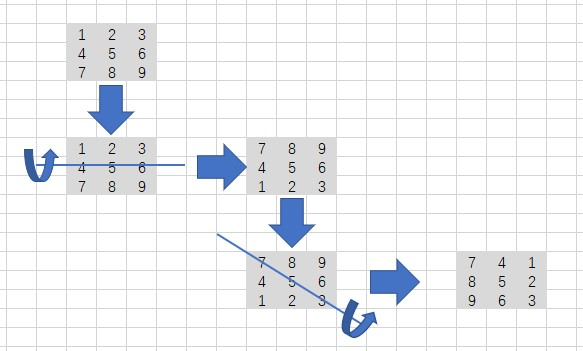

# 旋转矩阵

# 描述
给你一幅由 N × N 矩阵表示的图像，其中每个像素的大小为 4 字节。请你设计一种算法，将图像旋转 90 度。
不占用额外内存空间能否做到？
```c
示例 1:

给定 matrix = 
[
  [1,2,3],
  [4,5,6],
  [7,8,9]
],

原地旋转输入矩阵，使其变为:
[
  [7,4,1],
  [8,5,2],
  [9,6,3]
]


示例 2:

给定 matrix =
[
  [ 5, 1, 9,11],
  [ 2, 4, 8,10],
  [13, 3, 6, 7],
  [15,14,12,16]
], 

原地旋转输入矩阵，使其变为:
[
  [15,13, 2, 5],
  [14, 3, 4, 1],
  [12, 6, 8, 9],
  [16, 7,10,11]
]
```

# 解析
- 由于不能使用额外的空间来进行计算，所以只能原地操作
- 可以将整个过程分为两步进行
- 第一步，先上下旋转矩阵
- 第二步，沿对角线旋转矩阵
- 经过上面两部，便可以完成矩阵的90°旋转
- 由于时 n * n 的矩阵，因此在对角线旋转时不需要考虑旋转之后的相关位置信息是否正确


# 代码实现
## CPP
```cpp
class Solution {
public:
    void rotate(vector<vector<int>>& matrix) {
        int n = matrix.size();
        if (n == 0)
            return;
        int temp;
        // 上下翻转
        for (int i = 0; i < n; i++)
        {
            for (int j = 0; j< n / 2; j++)
            {
                temp = matrix[j][i];
                matrix[j][i] = matrix[n - j - 1][i];
                matrix[n - j - 1][i] = temp;
            }
        }
        // 对角线翻转
        for (int i = 0; i < n; i++)
        {
            for (int j = 0; j < i; j++)
            {
                temp = matrix[i][j];
                matrix[i][j] = matrix[j][i];
                matrix[j][i] = temp;
            }
        }
    }
};
```