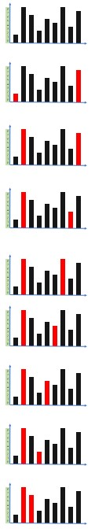

# 盛最多水的容器


## 题目描述
给你 n 个非负整数 a1，a2，...，an，每个数代表坐标中的一个点 (i, ai) 。在坐标内画 n 条垂直线，垂直线 i 的两个端点分别为 (i, ai) 和 (i, 0) 。找出其中的两条线，使得它们与 x 轴共同构成的容器可以容纳最多的水。

说明：你不能倾斜容器。

 

#### 示例 1：

```c
输入：[1,8,6,2,5,4,8,3,7]
输出：49 
解释：图中垂直线代表输入数组 [1,8,6,2,5,4,8,3,7]。在此情况下，容器能够容纳水（表示为蓝色部分）的最大值为 49。
```

#### 示例 2：
```c
输入：height = [1,1]
输出：1
```

#### 示例 3：
```c
输入：height = [4,3,2,1,4]
输出：16
```

#### 示例 4：
```c
输入：height = [1,2,1]
输出：2
```
 
```c
提示：
n = height.length
2 <= n <= 3 * 104
0 <= height[i] <= 3 * 104
```


## 解析
### 方法1：双指针
- 分别使用两个指针指向数组头部和尾部
- 计算两个指针之间可以存放的水量
- 判断两个指针的当前值，移动较小值的指针
- 知道两个指针相遇，过程中保存最大的乘积就是最大的盛水量



## 代码实现
### 方法1: 双指针
#### CPP
```C++
class Solution {
public:
    int maxArea(vector<int>& height) {
        int ret = 0;
        int left = 0;
        int right = height.size() - 1;
        while(left != right)
        {
            ret = max(ret, ((right - left) * min(height[left], height[right])));
            if (height[left] > height[right])
                right--;
            else
                left++;
        }
        return ret;
    }
};
```