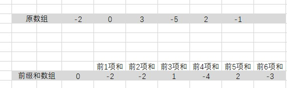

# 区域和检索 - 数组不可变

## 题目描述
给定一个整数数组  nums，求出数组从索引 i 到 j（i ≤ j）范围内元素的总和，包含 i、j 两点。

实现 NumArray 类：
- NumArray(int[] nums) 使用数组 nums 初始化对象
- int sumRange(int i, int j) 返回数组 nums 从索引 i 到 j（i ≤ j）范围内元素的总和，包含 i、j 两点（也就是 sum(nums[i], nums[i + 1], ... , nums[j])）
 
#### 示例：
```c
输入：
["NumArray", "sumRange", "sumRange", "sumRange"]
[[[-2, 0, 3, -5, 2, -1]], [0, 2], [2, 5], [0, 5]]
输出：
[null, 1, -1, -3]

解释：
NumArray numArray = new NumArray([-2, 0, 3, -5, 2, -1]);
numArray.sumRange(0, 2); // return 1 ((-2) + 0 + 3)
numArray.sumRange(2, 5); // return -1 (3 + (-5) + 2 + (-1)) 
numArray.sumRange(0, 5); // return -3 ((-2) + 0 + 3 + (-5) + 2 + (-1))
```

##### 提示：
```c
0 <= nums.length <= 104
-105 <= nums[i] <= 105
0 <= i <= j < nums.length
最多调用 104 次 sumRange 方法
```

## 解析
#### 方法1：前缀和
- 定义一个数组，用于存储前 n 个元素的和

- 当计算 left 和right 之间和时，只需相减即可


#### 方法2：暴力破解
- 拷贝数组，之后根据给定的 left 和 right 范围来遍历计算

## 代码实现
### CPP
#### 方法1：前缀和
```C++
class NumArray {
    vector<int> m_array;
public:
    NumArray(vector<int>& nums) {
        m_array.resize(nums.size() + 1);
        m_array[0] = 0;
        for (int i = 0; i < nums.size(); i++)
        {
            m_array[i + 1] = nums[i] + m_array[i];
        }
    }
    
    int sumRange(int left, int right) {
        return m_array[right + 1] - m_array[left];
    }
};

/**
 * Your NumArray object will be instantiated and called as such:
 * NumArray* obj = new NumArray(nums);
 * int param_1 = obj->sumRange(left,right);
 */
```
#### 方法2：暴力破解
```C++
class NumArray {
    vector<int> m_array;
public:
    NumArray(vector<int>& nums) {
        m_array.resize(nums.size());
        for (int i = 0; i < nums.size(); i++)
        {
            m_array[i] = nums[i];
        }
    }
    
    int sumRange(int left, int right) {
        if (m_array.size() < 1)
            return 0;
        int ret = 0;
        for (int i = left; i <= right; i++)
        {
            ret += m_array[i];
        }
        return ret;
    }
};

/**
 * Your NumArray object will be instantiated and called as such:
 * NumArray* obj = new NumArray(nums);
 * int param_1 = obj->sumRange(left,right);
 */
```