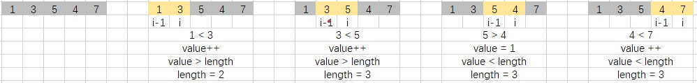

# 最长连续递增序列

## 题目描述
给定一个未经排序的整数数组，找到最长且 连续递增的子序列，并返回该序列的长度。
连续递增的子序列 可以由两个下标 l 和 r（l < r）确定，如果对于每个 l <= i < r，
都有 nums[i] < nums[i + 1] ，那么子序列 [nums[l], nums[l + 1], ..., nums[r - 1], nums[r]] 就是连续递增子序列。

 
```c
示例 1：
输入：nums = [1,3,5,4,7]
输出：3
解释：最长连续递增序列是 [1,3,5], 长度为3。
尽管 [1,3,5,7] 也是升序的子序列, 但它不是连续的，因为 5 和 7 在原数组里被 4 隔开。 

示例 2：
输入：nums = [2,2,2,2,2]
输出：1
解释：最长连续递增序列是 [2], 长度为1。
 
提示：
0 <= nums.length <= 104
-109 <= nums[i] <= 109
```

## 解析
- 可以直接遍历数组，判断两个数据之间是否时递增关系，如果是则更新记录值，否则记录值置 1，
同时需要记录递增的长度
- 图解



## 代码
#### CPP
```c++
class Solution {
public:
    int findLengthOfLCIS(vector<int>& nums) {
        if (nums.size() <= 1)
            return nums.size();
        int length = 1;
        int value = 1;
        for (int i = 1; i < nums.size(); i++)       // 遍历数组
        {
            if (nums[i] > nums[i - 1])  // 判断是否为递增
                value++;
            else
                value = 1;
            length = length < value ? value : length;   // 更新长度值
        }
        return length;
    }
};
```