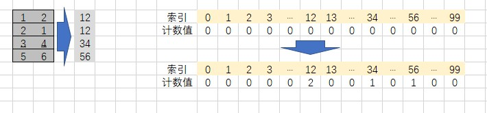

# 等价多米诺骨牌对的数量
## 题目描述
给你一个由一些多米诺骨牌组成的列表 dominoes。
如果其中某一张多米诺骨牌可以通过旋转 0 度或 180 度得到另一张多米诺骨牌，我们就认为这两张牌是等价的。
形式上，dominoes[i] = [a, b] 和 dominoes[j] = [c, d] 等价的前提是 a == c 且 b == d，或是 a == d 且 b==c。
在 0 <= i < j < dominoes.length 的前提下，找出满足 dominoes[i] 和 dominoes[j] 等价的骨牌对 (i, j) 的数量。

```C
示例：
输入：dominoes = [[1,2],[2,1],[3,4],[5,6]]
输出：1
 
提示：
1 <= dominoes.length <= 40000
1 <= dominoes[i][j] <= 9
```

## 解析
分析题目得知，每个中只有两个元素，斌且这两个元素的范围是 0 - 9，因此可以将这两个元素转换成一个数字来进行判断。
由于两个数组只要数字相同即可，所以需要保证每个数组在计算的时候是有序的。整体的大小超过100，因此只需要一个100大小的数组来存储生成的两位数即可。
因为数组初始化之后都是0，因此在出现相同的两个的时候，数据的值回被更新，这样即可完成计算。
计数的过程类似于桶排序。


## 代码实现
#### CPP
```C++
class Solution {
public:
    int numEquivDominoPairs(vector<vector<int>>& dominoes) {
        vector<int> nums(100);      // 创建的计数数组
        int ret = 0;
        int value = 0;
        for (int i = 0; i < dominoes.size(); i++)   // 遍历整个数组
        {
            if (dominoes[i][0] > dominoes[i][1])    // 计算两个数的大小关系，抓换为 两位数
                value = dominoes[i][0] * 10 + dominoes[i][1];
            else
                value = dominoes[i][1] * 10 + dominoes[i][0];
            /*
            * 累计要优先于更新计数值，因为两个数据才为一对
            */
            ret += nums[value]; // 将转换后的数值作为索引，计算总的对数
            nums[value]++;  // 更新数组计数值
        }
        return ret;
    }
};
```