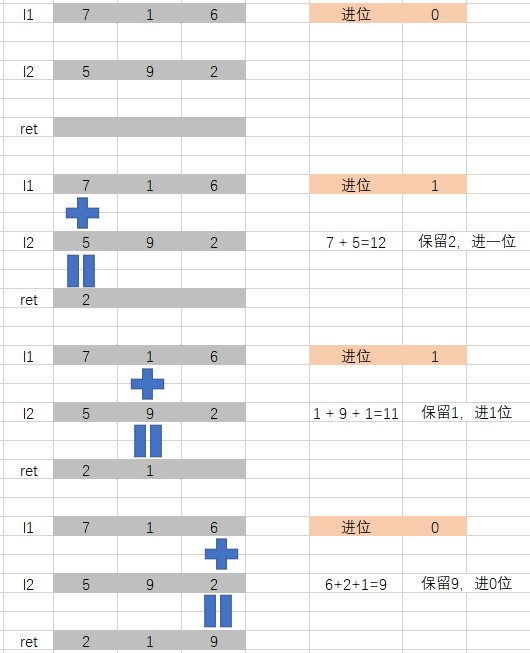

# 面试题 02.05. 链表求和

## 题目描述
给定两个用链表表示的整数，每个节点包含一个数位。

这些数位是反向存放的，也就是个位排在链表首部。

编写函数对这两个整数求和，并用链表形式返回结果。


#### 示例：
> 输入：(7 -> 1 -> 6) + (5 -> 9 -> 2)，即617 + 295
> 输出：2 -> 1 -> 9，即912

__进阶__：思考一下，假设这些数位是正向存放的，又该如何解决呢?

#### 示例：
> 输入：(6 -> 1 -> 7) + (2 -> 9 -> 5)，即617 + 295
> 输出：9 -> 1 -> 2，即912


## 解析
### 方法1：模拟按位加法
- 定义一个哑节点，由于数据的存储时从低位到高位，因此可以逐节点进行加法计算
- 同时记录进位的数据，累加到下一次计算中
- 

## 代码实现
### 方法1：模拟按位加法
#### CPP
```C++
/**
 * Definition for singly-linked list.
 * struct ListNode {
 *     int val;
 *     ListNode *next;
 *     ListNode(int x) : val(x), next(NULL) {}
 * };
 */
class Solution {
public:
    ListNode* addTwoNumbers(ListNode* l1, ListNode* l2) {
        if (l1 == NULL)
            return l2;
        if (l2 == NULL)
            return l1;
        ListNode* ret = new ListNode(0);
        ListNode* ret_p = ret;
        ListNode* l1_p = l1;
        ListNode* l2_p = l2;
        int value_b = 0;   // 进位
        int value_a = 0;   // 节点值
        while(l1_p != NULL && l2_p != NULL)
        {
            // 计算两个链表，按位进行加法计算
            value_a = l1_p->val + l2_p->val + value_b;
            value_b = value_a / 10;
            value_a %= 10;
            ListNode* temp = new ListNode(value_a);
            ret_p->next = temp;
            ret_p = ret_p->next;
            l1_p = l1_p->next;
            l2_p = l2_p->next;
        }
        while(l1_p != NULL)
        {
            // 如果l1链表没有计算结束
            value_a = l1_p->val + value_b;
            value_b = value_a / 10;
            value_a %= 10;
            ListNode* temp = new ListNode(value_a);
            ret_p->next = temp;
            ret_p = ret_p->next;
            l1_p = l1_p->next;
        }
        while(l2_p != NULL)
        {
            // 如果l2链表没有计算结束
            value_a = l2_p->val + value_b;
            value_b = value_a / 10;
            value_a %= 10;
            ListNode* temp = new ListNode(value_a);
            ret_p->next = temp;
            ret_p = ret_p->next;
            l2_p = l2_p->next;
        }
        if (value_b != 0)
        {
            // 最后判断是否有进位值
            ListNode* temp = new ListNode(value_b);
            ret_p->next = temp;
            ret_p = ret_p->next;
        }
        ret_p->next = NULL;
        return ret->next;
    }
};
```